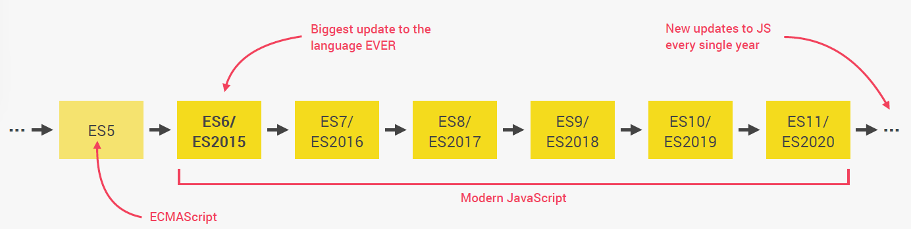

# Cornell Notes

## Topic: [Insert Topic Here]  

## Date: [Insert Date Here]  

---

### Cue Column (Questions, Keywords, or Prompts)

- [Insert question or keyword]
- [Insert question or keyword]
- [Insert question or keyword]

---

### Notes Section (Main Notes)

**1. What is javascript?**
- Javascript is a high-level, object-oriented, multi-paradigm programming language
  - **High-level**: We don’t have to worry about complex
stuff like memory management
  - **Object-oriented**: Based on objects, for storing most kinds of data
  - **Multi-paradigm**: We can use different styles of programming

**2. The role of Javascript in web development**
- There are 3 elements which each plays its role:
  - **HTML:** content
  - **CSS:** Presentation
  - **JS:** programming language: build web applications

**3. There is nothing you can not do with Javascript**
- Dynamic effects and web applications in the browser (Front-end apps): React, Angular or Vue
- Web applications on web servers: Node.js
- Native mobile applications: React, Ionic
- Native desktop applications: Electron

**4. Javascript releases**

---

<!-- ### Summary Section (Summary of Notes) -->

[Insert a brief summary of the key ideas and takeaways]
