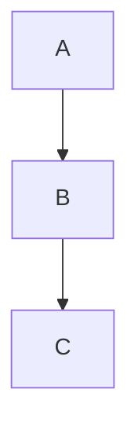

# Markdown Syntax Guide

---

## 1. Headings
Use `#` to define headings. Add more `#` for smaller headings (up to six levels).  
```markdown
# Heading 1  
## Heading 2  
### Heading 3  
#### Heading 4  
##### Heading 5  
###### Heading 6  
```

---

## 2. Text Formatting
- **Bold**: `**bold text**` or `__bold text__`  
  ```markdown
  **This is bold text**
  ```
- **Italic**: `*italic text*` or `_italic text_`  
  ```markdown
  *This is italic text*
  ```
- **Bold and Italic**: `***bold and italic***`  
  ```markdown
  ***This is bold and italic***
  ```
- **Strikethrough**: `~~strikethrough~~`  
  ```markdown
  ~~This text is struck through~~
  ```

---

## 3. Lists
### Unordered Lists:
Use `-`, `*`, or `+`:
```markdown
- Item 1  
- Item 2  
  - Sub-item  
    - Sub-sub-item  
```

### Ordered Lists:
Use numbers followed by periods:
```markdown
1. Step 1  
2. Step 2  
   1. Sub-step  
   2. Sub-step  
```

---

## 4. Links
### Basic Link:
```markdown
[Text](https://example.com)
```

### Reference Link:
```markdown
[Text](id)  
(id): https://example.com
```

---

## 5. Images
### Basic Image:
```markdown

```

### Reference Image:
```markdown
![Alt text][image-id]  
[image-id]: image_url
```

---

## 6. Blockquotes
Use `>` for blockquotes.  
```markdown
> This is a blockquote.  
>> Nested blockquote.  
```

---

## 7. Code
### Inline Code:
```markdown
`inline code`
```

### Code Block:
```markdown
```language
def hello_world():
    print("Hello, World!")
```
```

---

## 8. Tables
```markdown
| Column 1 | Column 2 | Column 3 |  
|----------|----------|----------|  
| Row 1    | Data     | Data     |  
| Row 2    | Data     | Data     |  
```

---

## 9. Horizontal Rules
Create horizontal lines using `---`, `***`, or `___`.  
```markdown
---
```

---

## 10. Task Lists
Use `- [ ]` for incomplete tasks and `- [x]` for completed ones.  
```markdown
- [x] Completed task  
- [ ] Incomplete task  
```

---

## 11. Emojis
Use `:emoji_name:` to add emojis (if supported).  
```markdown
:smile: :rocket: :tada:
```

---

## 12. Math Equations
Use `$` for inline math and `$$` for block math (requires tools like KaTeX or MathJax).  
```markdown
$E = mc^2$

$$E = mc^2$$
```

---

## 13. Diagrams
Use tools like Mermaid or PlantUML for diagrams:
```markdown

```

---

## 14. Escaping Characters
Escape Markdown syntax using a backslash (`\`).  
```markdown
\*This will not be italicized\*
```

---

## 15. Footnotes
```markdown
Here is a footnote reference[^1].  
[^1]: This is the footnote text.
```

---

## 16. HTML in Markdown
Insert HTML for advanced formatting:
```markdown
<div style="color:blue">This text is blue!</div>
```

---
