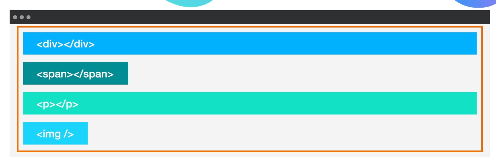
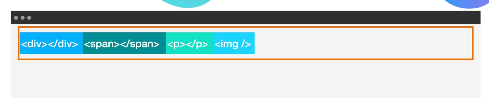

# Flexbox

## Topic: Display: Flex

## Date: 26/04/2025

---

### Cue Column (Questions, Keywords, or Prompts)

- [Insert question or keyword]
- [Insert question or keyword]
- [Insert question or keyword]

---

### Notes Section (Main Notes)

- We have some thing called **tables**, so we could create a "table" element with table rows (tr) and table data (td):

```
index.html:
<table>
    <tr class="row">
        <td> class="rol1">...</td>
        <td> class="rol2">...</td>
        <td> class="rol3">...</td>
    </tr>
</table>

styles.css:
.col1{
    width: 25%;
}
.col2{
    width: 25%;
}
.col3{
    width: 40%;
}

```
- The table element is still very much in use in modern web design. However, it should only be used when semantically you're actually trying to create a table.

- But currently there are much, much better tools to do this nowadays, and they started using what we call Display Property.
```
index.html:
<div class="one"><p>...</p></div>
<div class="two"><p>...</p></div>
<div class="three"><p>...</p></div>

styles.css:
div{
    display: inline-block;
    background-color: blueviolet;
}
.one{
    width: 25%;
}
.two{
    width: 25%;
}
.three{
    width: 40%;
}

```
- Float is great when you want to float an image to the left or the right of a block of text to wrap the text around it but don't use float for layout.

- With flexbox, all you need to do is to wrap your divs inside a container and then target that container in your CSS and set the display to "flex".

```
index.html:
<div class="container">
    <div class="one"><p>...</p></div>
    <div class="two"><p>...</p></div>
    <div class="three"><p>...</p></div>
</div>

styles.css:
.container{
    display: flex;
    gap: 10px;
}

```
- You can also add a **gap** between each of these items and there's a whole lot more that we're going to cover in this module.
- When we're thinking about Flexbox, we have to throw all of the display that we have learnt out of the window. When you make something flex, it no longer abides by any of these rules. **It's a different system with different rules and we have to learn about it and think about it as a separate entity.** 
- Summarize:
  - ``` <div></div> ```: by default going to be full width block.
  - ``` <span></span> ```: by default going to be an inline element.

- However, when you use Flexbox and you enclose all of the elements that you want to display inside a flexible container, then what happens is all of these previous display values will be ignored.
- From this:

- To this:

- The width of each of the elements inside the Flexbox will normally be based on the content size. We can add a gap property to make a gap between elemeents.
- There are also things where instead of setting the container to be **display:flex**, we can actually set it to be:
  - **display: inline-flex**: Allow flexbox to occupy as much as it needs, but it means that other things can also go and occupy that same line.

---

### Summary Section (Summary of Notes) 

