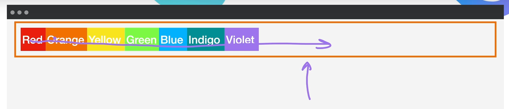

# Flexbox

## Topic: Flex Direction

## Date: 28/04/2025

---

### Cue Column (Questions, Keywords, or Prompts)

- [Insert question or keyword]
- [Insert question or keyword]
- [Insert question or keyword]

---

### Notes Section (Main Notes)

- Flex direction is how we can modify our Flexbox in order to achieve the layouts that we want.
- By default, this flex-direction is set to row.

- If we had set the flex-direction to column, then what it's going to do is to make all of the items inside the container go from top to bottom means that we will change the **main axis** and now will be from top to bottom.
- There is 1 property **flex-basis** and it will expand along the main axis to satisfy that requirement of each element.
  - if the main axis is from left to right, it will expand the width
  - if the main axis is from top to bottom, it will expand the height

---

### Summary Section (Summary of Notes) 

